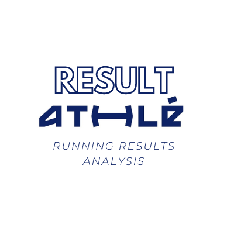

# ResultAthle
<p align="center"></p>

#### *Problématique : Comment rendre l'outil statistique facile d'accès au niveau amateur dans l'athléthisme ?*

Sujet à aborder : difficile manipulation des données et le manque de statiques descriptives accessibles que ce soit au niveau des clubs, des courses ou individuel.

Question : quel output final obtenir? API, pipeline, application

## Jeu de données

#### Etape 1 : Scrapping sur les url de bases.athle.fr (détails dans le wiki)

Objectif : récupérer les données de la FFA (nombre de coureurs, ligues, temps, catégories, clubs, labels des performances...)

Pour récupérer le fichier `.csv` contenant la liste des résultats d'une compétition running du site de résultats bases.athle, on peut utiliser le notebook __scraping.ipynb__ ou simplement la commande suivante :

```sh
$ python scraping.py "url" nb_pages
```

avec `url` l'url de bases.athle de la compétition à scraper et `nb_pages` le nombre de pages de résultats que l'on souhaite scrapper.

Exemple : 


## Visualisation

#### Etape 2 : Sélection statistiques descriptives

*Exemple : Statistique par catégorie/année de naissance*

Benchmark : record de la catégorie étudié au niveau français par exemple

#### Etape 3 : Construction des graphiques pour représenter les indicateurs retenus

Objectif : visualisation complète des différents indicateurs retenus après avoir sélectionné la course et la catégorie (ou même nom/prénom?)

*Exemple : Distributions des temps*

*Exemple : Distributions des écarts*

## Modélisation
(détails dans le wiki)

#### Étape 4 : Détermination des catégories de courreurs et des objectifs  de performance pour les course de longue durée.
*Exemple : au maraton, la densité des temps d'arrivée est forte juste en dessous de 3h, 4h... Comment repérer ces pics de densité ?*

*On voit souvent au moins deux "bosses" dans la densité des temps, correspondant à deux types d'athlètes : les coureurs performants et les "coureurs du dimanche", qui n'ont généralement pas les mêmes objectifs. Comment séparer ces deux catégories ?*

