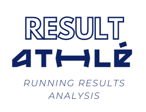

# ResultAthle
<p align="center"></p>

ResultAthle is a project aimed at making statistical tools more accessible at the amateur level in athletics. It addresses the challenges of data manipulation and the lack of accessible descriptive statistics at the club, race, or individual level.

## Table of Contents

- [Installation](#installation)
- [Usage](#usage)
- [Features under development](#features-under-development)
- [Contributing](#contributing)
- [License](#license)

## Installation

To install the necessary dependencies, run the following command:

```sh
pip install -r requirements.txt
```

## Usage

To retrieve the '.csv' file containing the list of results from a running competition on the bases.athle results site, you can use the 'scraping.ipynb' notebook or simply run the following command:

```sh
python scraping.py "url" nb_pages
```

Where 'url' is the [bases.athle](https://bases.athle.fr/) URL of the competition to scrape and 'nb_pages' is the number of result pages you want to scrape.

Example : 


## Get HTML file with Quarto

Quarto is to be downloaded here: [Quarto URL](https://quarto.org/docs/get-started/).

To convert the main.ipynb to HTML, run:

```sh
quarto render .\main.ipynb --to html
```

To preview the HTML in localhost, run:

```sh
quarto preview .\main.ipynb
```

## Features Under Development

We are continuously working to improve ResultAthle and add new features. Here are some of the features that are currently under development:

- **WebApp:** we are developing a web application version of ResultAthle. This webapp will provide users with the flexibility to access and analyze race results from [bases.athle](https://bases.athle.fr/).

- **Advanced Scraping Functions:** We are in the process of enhancing our web scraping capabilities to provide a more robust and sophisticated data extraction process. This will allow us to gather more detailed and comprehensive data from athletics competitions.

- **Visualization:** We are working on new visualization features that will allow users to better understand and interpret the data. This includes various types of charts and graphs.

- **Performance Analysis:** We are developing new features for analyzing athletic performance. This will include statistical analysis and machine learning algorithms to identify patterns and trends in the data.

Stay tuned for these exciting new features!

## Contributing

We welcome contributions to ResultAthle! Here's how you can help:

1. **Fork the Repository:** Start by forking the ResultAthle repository to your own GitHub account.

2. **Clone the Repository:** Next, clone the repository to your local machine so you can start making changes.

3. **Create a New Branch:** Make a new branch for your changes. This helps keep everything organized and separates your changes from the main codebase.

4. **Make Your Changes:** Now you can start making changes to the code. Whether it's fixing a bug, adding a new feature, or improving documentation, your contributions are greatly appreciated!

5. **Commit Your Changes:** Once you're done making changes, commit them with a clear and concise commit message.

6. **Push Your Changes:** Push your changes to your forked repository on GitHub.

7. **Submit a Pull Request:** Finally, submit a pull request so your changes can be reviewed and, if approved, merged into the main codebase.

Please make sure to follow the project's coding standards and to test your code before submitting a pull request. If you have any questions, feel free to ask!

## License

ResultAthle is licensed under the MIT License. This means you are free to use, modify, and distribute the project, as long as you include the original copyright and license notice in any copy of the software/source.

For more information on the MIT License, see the [LICENSE](LICENSE) file in this repository or visit [MIT License](https://opensource.org/licenses/MIT).
